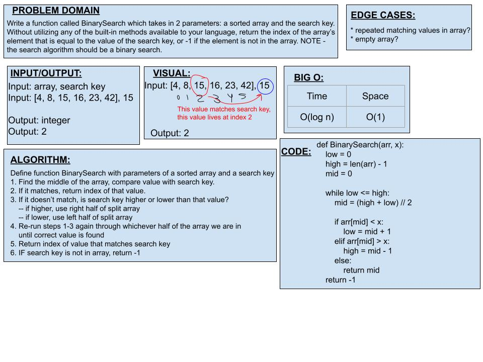

# Code Challenge 02: Binary Search of Sorted Array

## *Author: Kassie Bradshaw*

[Link to PR for this code challenge](https://github.com/kassiebradshaw/data-structures-and-algorithms/pull/25)

### Credit & Collaboration:

* Collaborated with Prabin Singh
* Used [this link](https://www.geeksforgeeks.org/python-program-for-binary-search/) to understand and write code

---

## Problem Domain:

**Binary search in a sorted 1D array** -- Whiteboard ONLY

[x] Write a function called `BinarySearch` which takes in 2 parameters: a sorted array and the search key. Without utilizing any of the built-in methods available to your language, return the index of the array's element that is equal to the value of the search key, or -1 if the element is not in the array.

* [x] Note: The search algorithm used in your function should be a binary search.
  * Check the Resources section for details

### Stretch Goal:

* [ ] What would you need to change if the array contained objects (sorted on a given property), and you were searching for certain property value? Write out the pseudocode.

### Resources:

* [Wikipedia: Binary Search Algorithm](https://en.wikipedia.org/wiki/Binary_search_algorithm)

---

### Inputs and Expected Outputs:

| Input | Expected Output |
| :----------- | :----------- |
| `[4, 8, 15, 16, 23, 42], 15` | `2` |
| `[-131, -82, 0, 27, 42, 68, 179], 42` | `4` |
| `[11, 22, 33, 44, 55, 66, 77], 90` | `1` |
| `[1, 2, 3, 5, 6, 7], 4` | `-1` |

---

### Big O:

| Time | Space |
| :----------- | :----------- |
| O(log n) | O(1) |

---

### Whiteboard Visual:

---

### Change Log:

06-14-21:

* Scaffolded README for code challenge
