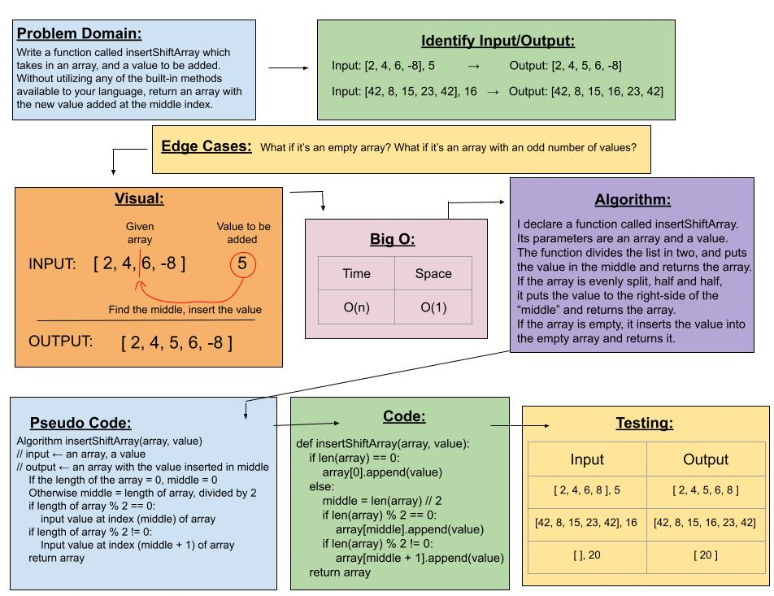

# Code Challenge 02: Shift an Array

## *Author: Kassie Bradshaw*

[Link to PR for this code challenge](https://github.com/kassiebradshaw/data-structures-and-algorithms/pull/24)

---

## Problem Domain

**Insert and shift an array in middle at index** -- Whiteboard ONLY

Write a function called `insertShiftArray` which takes in an array and a value to be added. Without utilizing any of the built-in methods available to your language, return an array with the new value added at the middle index.

---

### Inputs and Expected Outputs

| Input | Expected Output |
| :----------- | :----------- |
| `[2,4,6,-8], 5` | `[2,4,5,6,-8]` |
| `[42,8,15,23,42], 16` | `[42,8,15,16,23,42]` |

---

### Big O

| Time | Space |
| :----------- | :----------- |
| O(n) | O(1) |

---

### Whiteboard Visual

---

### Change Log

06-10-21:

* Initial attempt at Code Challenge
* Input Whiteboard image in README
