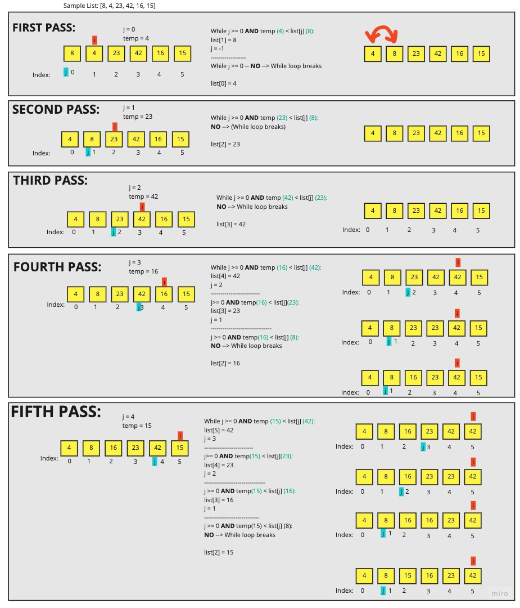

# My Article about Insertion Sort

The explanation of "insertion sort" from [GeeksforGeeks](geeksforgeeks.org/insertion-sort/) seems simple enough:

> Insertion sort is a simple sorting algorithm that works similar to the way you sort playing cards in your hands. The array is virtually split into a sorted and an unsorted part. Values from the unsorted part are picked and placed at the correct position in the sorted part.

## Given Pseudo-code

```Python
  InsertionSort(int[] arr)

    FOR i = 1 to arr.length

      int j <-- i - 1
      int temp <-- arr[i]

      WHILE j >= 0 AND temp < arr[j]
        arr[j + 1] <-- arr[j]
        j <-- j - 1

      arr[j + 1] <-- temp
```

## Understanding the Algorithm

This algorithm starts at the 2nd item in the list (the item at index 1). It assigns that value to a `temp` variable.

It creates a variable `j` to keep a starting point for the 'item before `i`' in the list.

Then it instantiates a while loop, comparing the currrent item to the one before it. If the current item is less than the one before it, the current item is reassigned the same value as the (higher) one before it. This solves the problem of shifting higher numbers up in the list to make room for the lower numbers to come before it. Now the value we started with lives only inside the `temp` variable - we need to find where it goes in the list.

The variable `j` is then decremented by 1, so as to compare the `temp` variable (the original "current" value) to the next lowest number in the list. Continue the while loop process until our `j` is less than 0, OR our `temp` variable is less than the value of our list at index `j`.

The final step in the algorithm is to put the value we're trying to sort in its proper place.

Once the while loop conditions are no longer met, that means our the algorithm has found where our `temp` variable - the original value we were trying to sort - needs to go. The algorithm reassigns the value at `j + 1` to whatever value our `temp` variable is holding.

## Sample List

`[8,4,23,42,16,15]`

## PASS BY PASS BREAKDOWN


