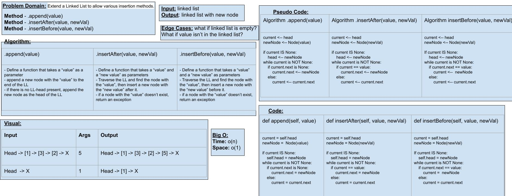
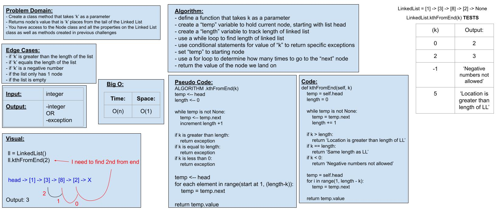

# Challenge 05: Linked List Implementation & Challenge 06: Insertion Methods

Author: *Kassie Bradshaw*

[Link to PR for challenge 05](https://github.com/kassiebradshaw/data-structures-and-algorithms/pull/26)

[Link to PR for challenge 06](https://github.com/kassiebradshaw/data-structures-and-algorithms/pull/27)

[Link to PR for challenge 07](https://github.com/kassiebradshaw/data-structures-and-algorithms/pull/29)

---

## Code Challenge 05: Singly Linked List

* [x] Create a Node class that has properties for the value stored in the Node, and a pointer to the next Node.

* [x] Within your LinkedList class, include a head property. Upon instantiation, an empty LinkedList should be created.
  * [x] Define a method called `insert` which takes any value as an argument and adds a new node with that value to the `head` of the list with an O(1) Time performance.
  * [x] Define a method called `includes` which takes any value as an argument and returns a boolean result depending on whether that value exists as a Node's value somewhere in the list.
  * [ ] Define a method called `__str__` which takes no arguments and returns a string representing all the values in the Linked List, formated as:
    * `"{ a } -> { b } -> { c } -> NONE"`

---

## Code Challenge 06: Extend a Linked List to allow various insertion methods

Write the following methods for the Linked List class:

* [ ] `.append(value)` which adds a new node with the given `value` to the end of the list
* [ ] `.insertBefore(value, newVal)` which adds a new node with the given `newValue` immediately before the first `value` node
* [ ] `.insertAfter(value, newVal)` which adds a new node with the given `newValue` immediately after the first `value` node

## Examples

Method: **`.append(value)`**

| Input | Args | Output |
|---|---|---|
| `head -> [1] -> [3] -> [2] -> X` | `5` |  `head -> [1] -> [3] -> [2] -> [5] -> X` |
| `head -> X` | `1` | `head -> [1] -> X` |

Method: **`.insertBefore(value, newVal)`**

| Input | Args | Output |
|---|---|---|
| `head -> [1] -> [3] -> [2] -> X` | `3, 5` | `head -> [1] -> [5] -> [3] -> [2] -> X` |
| `head -> [1] -> [3] -> [2] -> X` | `1, 5` | `head -> [5] -> [1] -> [3] -> [2] -> X` |
| `head -> [1] -> [2] -> [2] -> X` | `2, 5` | `head -> [1] -> [5] -> [2] -> [2] -> X` |
| `head -> [1] -> [3] -> [2] -> X` | `4, 5` | `Exception` |

Method: **`.insertAfter(value, newVal)`**

| Input | Args | Output |
|---|---|---|
| `head -> [1] -> [3] -> [2] -> X` | `3, 5` | `head -> [1] -> [3] -> [5] -> [2] -> X` |
| `head -> [1] -> [3] -> [2] -> X` | `2, 5` | `head -> [1] -> [3] -> [2] -> [5] -> X` |
| `head -> [1] -> [2] -> [2] -> X` | `2, 5` | `head -> [1] -> [2] -> [5] -> [2] -> X` |
| `head -> [1] -> [3] -> [2] -> X` | `4, 5` | `Exception` |

---

## Code Challenge 07: Extending an implementation

Write the following method for the Linked List class:

* kth from end
  * argument: a number, `k`, as a parameterou have access to the Node class and all the properties on the Linked List class as well as the methods created in previous challenges.

**Examples**:

Method: **`ll.kthFromEnd(k)`**

| Input -> `ll` | Arg -> `k` | Output |
|---|---|---|
| `head -> [1] -> [3] -> [8] -> [2] -> X` | `0` | `2` |
| `head -> [1] -> [3] -> [8] -> [2] -> X` | `2` | `3` |
| `head -> [1] -> [3] -> [8] -> [2] -> X` | `6` | `Exception` |

---

Whiteboard Visual for Code Challenge 06

Whiteboard Visual for Code Challenge 07

---

### Testing

Code Challenge 5 Tests:

1. [x] Can successfully instantiate an empty linked list
2. [x] Can properly insert into the linked list
3. [x] The head property will properly point to the first node in the linked list
4. [ ] Can properly insert multiple nodes into the linked list
5. [x] Will return true when finding a value within the linked list that exists
6. [x] Will return false when searching for a value in the linked list that does not exist
7. [ ] Can properly return a collection of all the values that exist in the linked list

Code Challenge 6 Tests:

1. [ ] Can successfully add a node to the end of the linked list
2. [ ] Can successfully add multiple nodes to the end of a linked list
3. [ ] Can successfully insert a node before a node located i the middle of a linked list
4. [ ] Can successfully insert a node before the first node of a linked list
5. [ ] Can successfully insert after a node in the middle of the linked list
6. [ ] Can successfully insert a node after the last node of the linked list

Code Challenge 7 Tests:

1. [x] Where k is greater than the length of the linked list
2. [x] Where k and the length of the list are the same
3. [x] Where k is not a positive integer
4. [x] Where the linked list is of a size 1
5. [x] “Happy Path” where k is not at the end, but somewhere in the middle of the linked list

---

## Change Log

**06-19-2021**: Started code challenge 5

**06-20-2021**: Turned in code challenge 5, all working except Linked List `__str__` method

**06-21-2021**: Started code challenge 6

**06-24-2021**: Started code challenge 7

**06-26-2021**: Added whiteboard image and PR link for Code Challenge 7, resubmitted assignment

---

## Collaboration & Credit

* [Help with printing linked list](https://www.google.com/search?q=how+can+you+print+a+linked+list%3F&oq=how+can+you+print+a+linked+list%3F&aqs=chrome..69i57j0i22i30l4.3070j0j7&sourceid=chrome&ie=UTF-8#kpvalbx=_FxzQYMvOG9Lh-gS77IPQBQ28)
* [Help with creating Node class methods](https://www.youtube.com/watch?v=Bd1L64clh34)

* Help from Michael Ryan with `__str__` method

* Collaborated with Daniel Dills, Michael Ryan, and Matt Santorsola for code challenge 7
