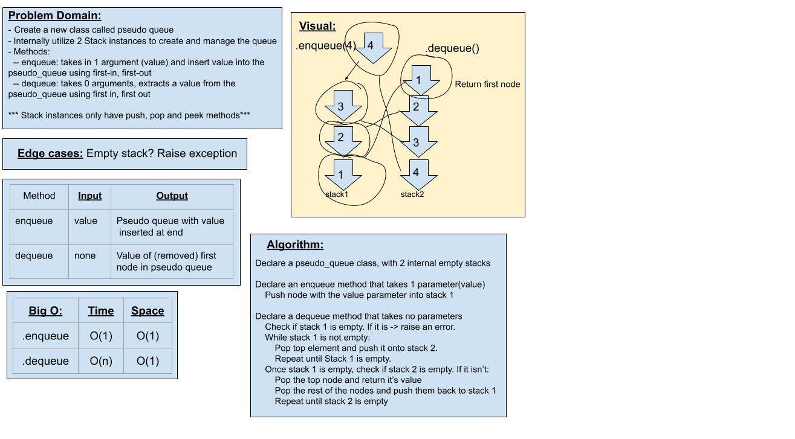

# Challenge 11 - Pseudo Queue

Author: *Kassie Bradshaw*

[Link to PR for challenge 11](https://github.com/kassiebradshaw/data-structures-and-algorithms/compare/stack-queue-pseudo?expand=1)

---

## Problem Domain

**Implement a Queue using two Stacks**

* [ ] Create a new class called pseudo queue
  * [ ] Do not use an existing queue
  * [ ] This PseudoQueue class will implement our standard queue interface (the 2 methods below)
  * [ ] Internally, utilize 2 Stack instances to create and manage the queue

* [ ] Methods
  * [ ] Enqueue:
    * [ ] Arguments: Value
    * [ ] Inserts value into the PseudoQueue using first-in, first-out approach
  * [ ] Dequeue:
    * [ ] Arguments: None
    * [ ] Extracts a value from the PseudoQueue using a first-in, first-out approach

* **NOTE**: The Stack instances have only push, pop and peek methods. You should use your own Stack implementation. Instantiate these stack objects in your PseudoQueue constructor

---

### Inputs and Expected Outputs

**`.enqueue(value)`**

| Input | Args | Expected Output |
| --- | --- | --- |
| `[10]->[15]->[20]` | `5` | `[5]->[10]->[15]->[20]` |
|  | `5` | `[5]` |

**`.dequeue()`**

| Input | Output | Internal State |
| --- | --- | --- |
| `[5]->[10]->[15]->[20]` | `20` | `[5]->[10]->[15]` |
| `[5]->[10]->[15]` | `15` | `[5]->[10]` |

---

### Big O

| Method | Time | Space |
| --- | -- | --- |
| `.enqueue(val)` | O(n) | O(1) |
| `.dequeue()` | O(n) | O(1) |

---

### Whiteboard Visual

---

### Change Log

07-07-2021:

* Initial attempt at Code Challenge
* No tests yet

---

### Collaborations & Credit

* Partnered with Daniel Dills
* Also collaborated with Marie Marcos & Garfield Grant
* Help from TA Ben Hill
* [Better Programming article I referenced](https://betterprogramming.pub/how-to-implement-a-queue-using-two-stacks-80772242b88c)
*[Geeks for Geeks video I watched](https://www.geeksforgeeks.org/queue-using-stacks/)
