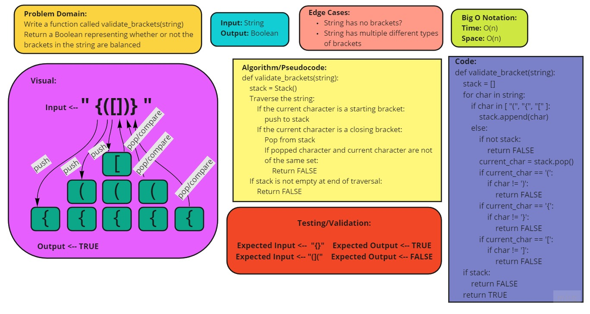

# Code Challenge 13 - Multi-Bracket Validation

## Challenge Type: Code Challenge / Algorithm

[Link to Pull Request](https://github.com/kassiebradshaw/data-structures-and-algorithms/pull/34)

[Credit for solution](https://www.geeksforgeeks.org/check-for-balanced-parentheses-in-an-expression/)

## Feature Tasks

* [ ] Write a function called `validate_brackets`
  * Arguments: string
  * Return: boolean - representing whether or not the brackets in the string are balanced

* There are 3 types of brackets
  * Round Brackets: `()`
  * Square Brackets: `[]`
  * Curly Brackets: `{}`

## Example

| Input | Output |
| --- | --- |
|`{}` | `TRUE` |
|`{}(){}` | `TRUE` |
| `()[[Extra Characters]]` |`TRUE` |
| `(){}[[]]` | `TRUE` |
| `{}{Code}[Fellows](())` | `TRUE` |
| `[({}]` | `FALSE` |
| `(](` | `FALSE` |
| `{(})` | `FALSE` |

* Consider these small examples and why they fail:

| Input | Output | Why |
| --- | --- | --- |
| `{`	| `FALSE`	| error unmatched opening `{` remaining. |
| `)` |	`FALSE`	| error closing `)` arrived without corresponding opening. |
| `[}` | `FALSE`	| error closing `}`. Doesn’t match opening `[`. |

### Whiteboard Visual

