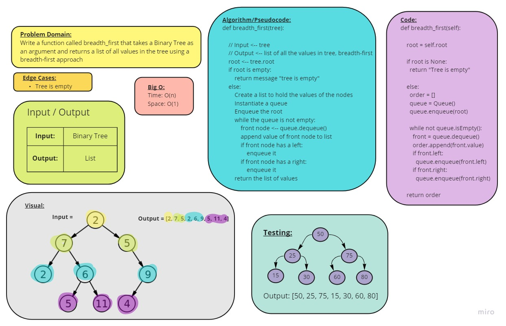

# Code Challenge 17 - Breadth-First Traversal

## Challenge Type: Code Challenge/Algorithm

[Link to Code](trees.py) (LINE 100)

[Link to Pull Request](https://github.com/kassiebradshaw/data-structures-and-algorithms/pull/37)

## Feature Tasks

* [x] Write a function called breadth first
  * Arguments: tree
  * Return: list of all values in the tree, in the order they were encountered
  * **NOTE**: Traverse the input tree using a Breadth-first approach

## Whiteboard Visual

## Tests

[My tests for this code challenge](/home/kbrad/codefellows/401/data-structures-and-algorithms/python/tests/test_trees.py) (Starts at line 95)

* test_breadth_first_example_tree
* test_breadth_first_negative_tree
* test_breadth_first_fruit_tree
* test_breadth_first_number_tree
