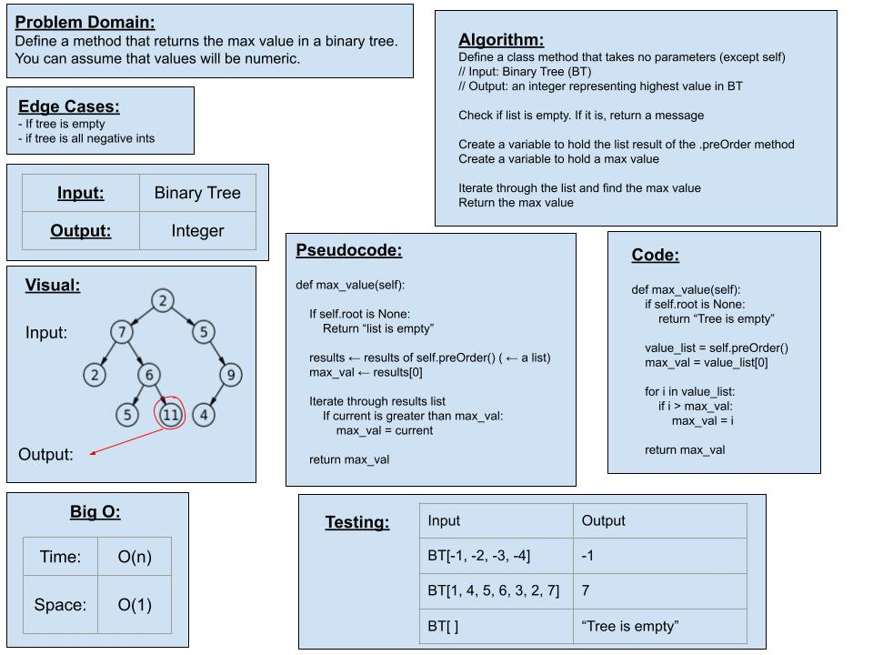

# Code Challenge 16 - Binary Tree Max Value

## Challenge Type: Extending an Implementation

[Link to Code](trees.py) (LINE 98)

[Link to Pull Request](https://github.com/kassiebradshaw/data-structures-and-algorithms/pull/36)

## Feature Tasks

Find the Maximum Value in a Binary Tree

*Note*: You can assume that the values stored in the Binary Tree will be numeric.

* [x] Write the following method for the Binary Tree class
  * [x] find maximum value
    * Arguments: none
    * Returns: number

## Whiteboard Visual

## Tests

[My tests for this code challenge](/home/kbrad/codefellows/401/data-structures-and-algorithms/python/tests/test_trees.py) (LINES 69-87)
