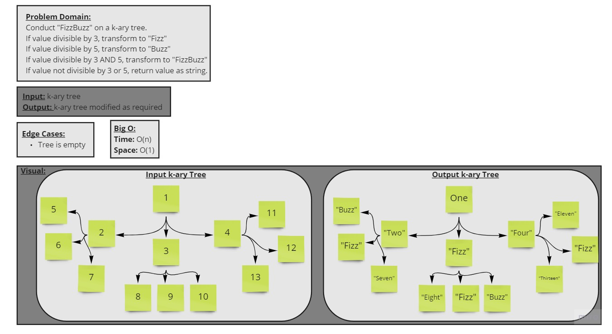

# Code Challenge 18 - Fizz Buzz K-ary Tree

[Link to Pull Request](https://github.com/kassiebradshaw/data-structures-and-algorithms/pull/39)

[Link to my code](k_ary.py)

---

## Overview

**Challenge Type**: Code Challenge/Algorithm

Conduct "FizzBuzz" on a k-ary tree while traversing through it to create a new tree.

Set the values of the nodes depending on the corresponding requirements.

---

## Feature Task

* [ ] Write a function called fizz buzz tree
  * [ ] Arguments: k-ary tree
  * [ ] Returns: modified k-ary tree

* [ ] Determine whether or not the value of each node is divisible by 3 or 5 or both. Modify the tree as follows:
  * [ ] Value divisible by 3 --> replace with "Fizz"
  * [ ] Value divisible by 5 --> replace with "Buzz"
  * [ ] Value divisible by 3 AND 5 --> replace with "FizzBuzz"
  * [ ] Value not divisible by 3 or 5 --> return number as String

---

## Requirements

* [ ] Write unit tests
* [ ] Whiteboard
* [ ] Well-formatted README

---

## Whiteboard Visual

---

## Collaboration & Credit
